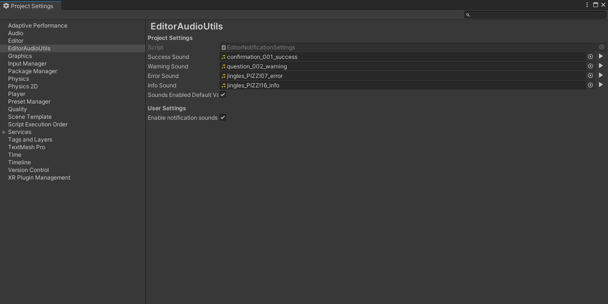

# EditorAudioUtils

*Like [EditorApplication.Beep()](https://docs.unity3d.com/ScriptReference/EditorApplication.Beep.html), but with configurable sounds*



[](https://openupm.com/packages/com.jd.editoraudioutils/)  [](https://github.com/johannesdeml/editoraudioutils/releases)  [](https://unity3d.com/get-unity/download/archive)

## Installation
Install the package with [OpenUPM](https://openupm.com/)

```sh
$ openupm add com.jd.editoraudioutils
```

or download the [Latest Unity Packages](../../releases/latest)

## Features

* Set your own notification sounds through Project Settings -> EditorAudioUtils
* Play custom notification sounds through a simple API
* Play, Pause, Resume and stop any AudioClip in the editor without the need of an AudioSource
* Handle different internal Unity API from Unity 2019 onwards
* Disable or overwrite notification sounds through EditorPrefs. This way each user can decide if and what notification settings they want, while the project itself contains the default settings.

## API

Play a predefined notification sound:
```csharp
EditorAudioUtility.PlayNotificationSound(EditorNotificationSound type);
```

Access other internal [AudioUtil](https://github.com/Unity-Technologies/UnityCsReference/blob/master/Editor/Mono/Audio/Bindings/AudioUtil.bindings.cs) methods ([EditorAudioUtility](../../main/Scripts/Editor/EditorAudioUtility.cs)):
```csharp
// Play clip
EditorAudioUtility.PlayPreviewClip(AudioClip audioClip);
EditorAudioUtility.PlayPreviewClip(AudioClip audioClip, int startSample, bool loop);

// For Unity 2020+ the input will be ignored and applied to all clips
// You can use EditorAudioUtility.LastPlayedPreviewClip to get the last clip
EditorAudioUtility.PausePreviewClip(AudioClip audioClip);
EditorAudioUtility.ResumePreviewClip(AudioClip audioClip);
EditorAudioUtility.StopPreviewClip(AudioClip audioClip);

// Stop all clips
EditorAudioUtility.StopAllPreviewClips();
```


## License

* MIT - see [LICENSE](./LICENSE.md)
* Sounds in Sample are from [Kenney](https://kenney.nl/) (CC0)

