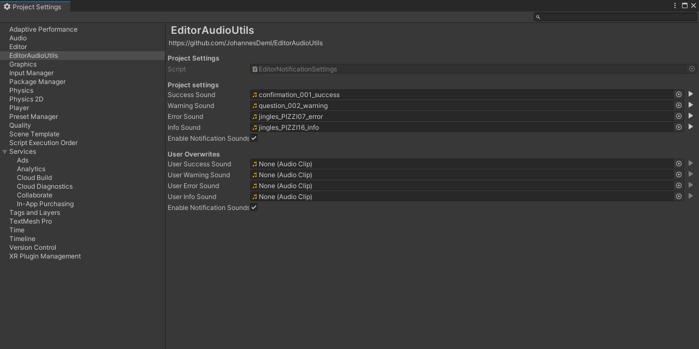

# EditorAudioUtils

*Like [EditorApplication.Beep()](https://docs.unity3d.com/ScriptReference/EditorApplication.Beep.html), but with configurable sounds*



## Installation
Install the package with [OpenUPM](https://openupm.com/)

```sh
$ openupm add com.jd.editoraudioutils
```

or download the [Latest Unity Packages](../../releases/latest)

## API

Play a predefined sound:
```csharp
EditorAudioUtility.PlayNotificationSound(EditorNotificationSound type);
```

Play any AudioClip in the editor:
```csharp
EditorAudioUtility.PlayAudioClip(AudioClip audioClip);
```


## License

* MIT - see [LICENSE](./LICENSE.md)

